# 校园二手交易平台 - 数据流图与UML文档

## 目录
1. [顶层数据流图](#1-顶层数据流图)
2. [用户认证与授权](#2-用户认证与授权)
3. [商品管理流程](#3-商品管理流程)
4. [留言与收藏](#4-留言与收藏)
5. [管理员后台](#5-管理员后台)
6. [完整数据流示例](#6-完整数据流示例)
7. [数据结构关系图](#7-数据结构关系图)
8. [状态管理数据流](#8-状态管理数据流)
9. [UML用例图](#9-uml用例图)
10. [数据库设计](#10-数据库设计)

---

## 1. 顶层数据流图

### 主要实体与流程
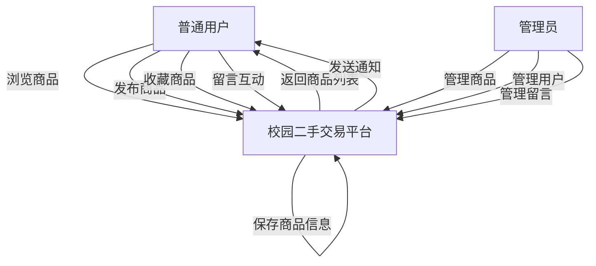

### 核心数据存储
| 数据存储 | 说明 |
|---------|------|
| 用户表 | 存储用户信息 |
| 商品表 | 存储商品信息 |
| 收藏表 | 存储收藏关系 |
| 留言表 | 存储留言记录 |

---

## 2. 用户认证与授权

### 2.1 用户注册流程
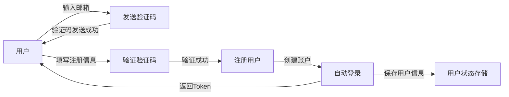

### 2.2 用户登录流程
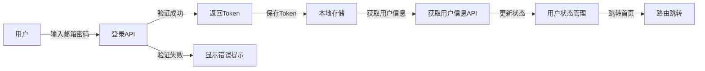

---

## 3. 商品管理流程

### 3.1 商品发布流程
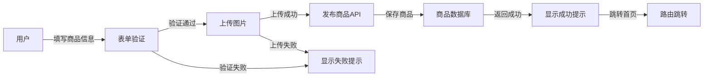

### 3.2 商品浏览与搜索
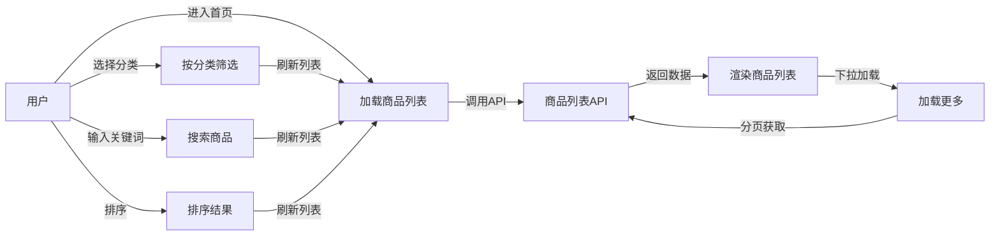

---

## 4. 留言与收藏

### 4.1 留言流程
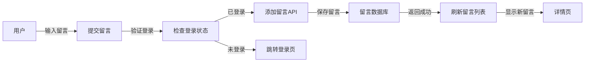

### 4.2 收藏流程
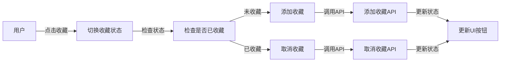

---

## 5. 管理员后台

### 5.1 商品管理
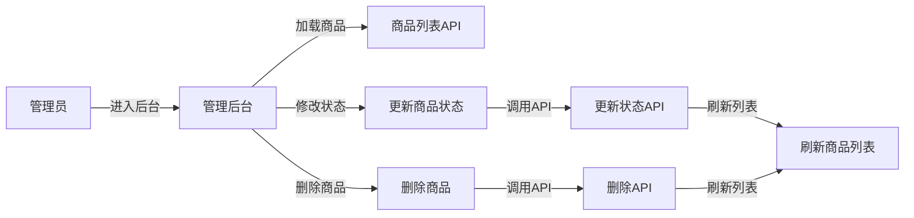

### 5.2 用户管理
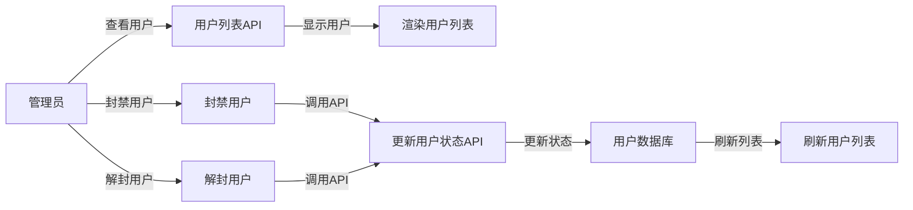

---

## 6. 完整数据流示例

### 用户发布商品的完整数据流
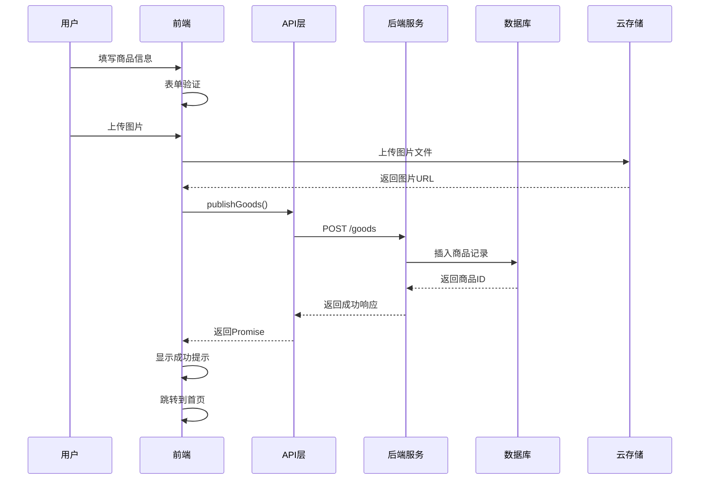

---

## 7. 数据结构关系图

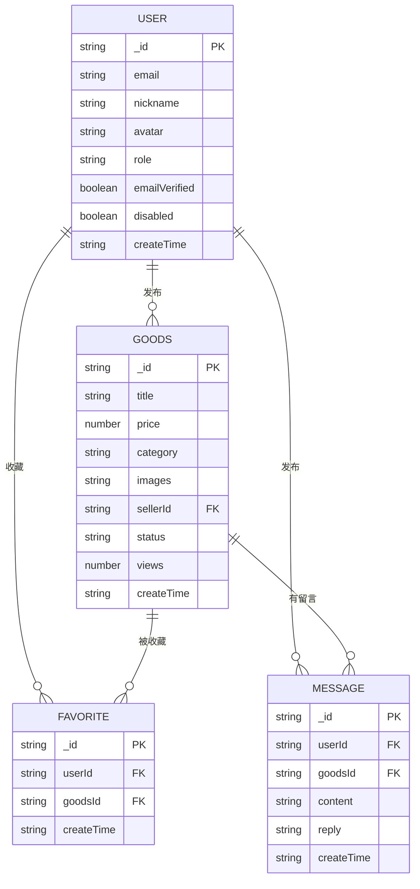

---

## 8. 状态管理数据流

### Pinia Store 数据流
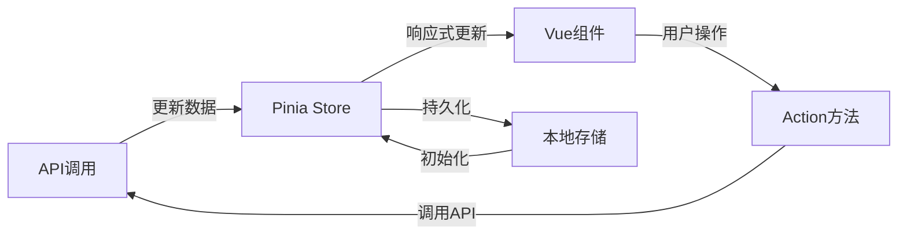

---

## 9. UML用例图

### 9.1 系统整体用例图
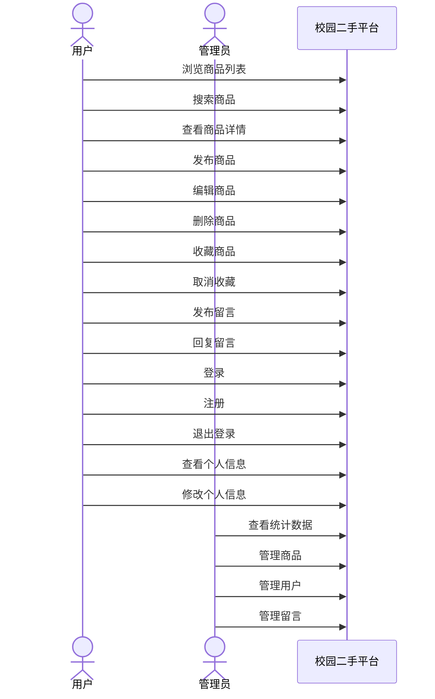

### 9.2 用户用例详细图
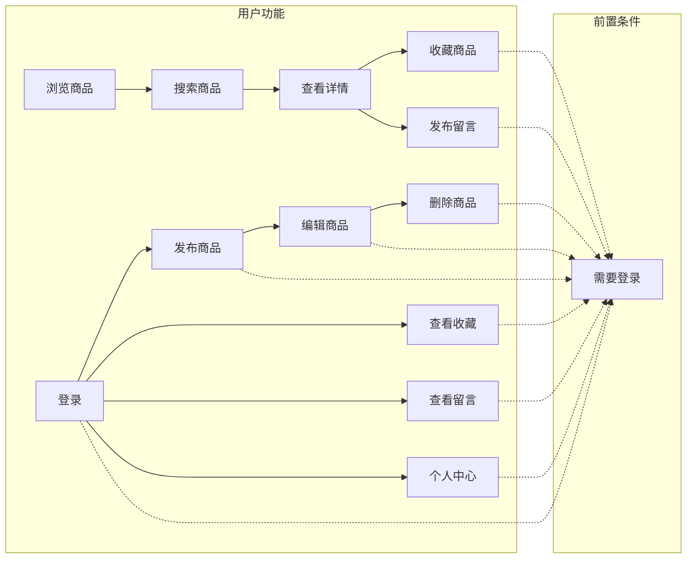

### 9.3 管理员用例图
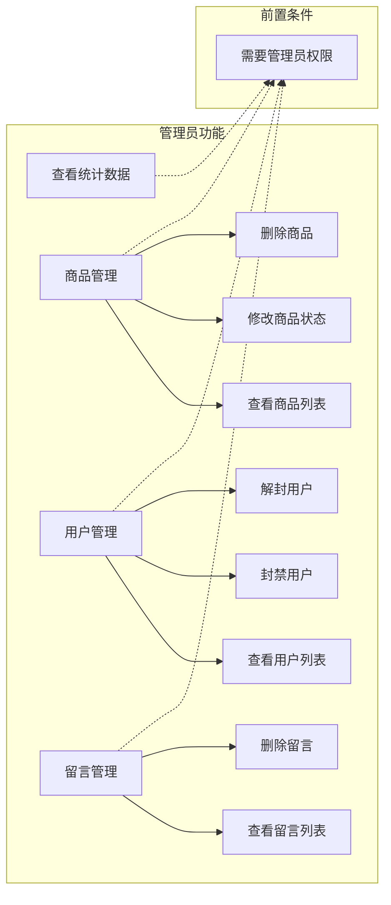

### 9.4 用例描述表

| 用例名称 | 参与者 | 前置条件 | 基本流程 | 后置条件 |
|---------|--------|---------|---------|---------|
| 浏览商品 | 用户 | 无 | 进入首页 → 显示商品列表 | 商品列表展示成功 |
| 搜索商品 | 用户 | 无 | 输入关键词 → 点击搜索 | 显示搜索结果 |
| 发布商品 | 用户 | 已登录 | 填写信息 → 上传图片 → 提交 | 商品发布成功 |
| 收藏商品 | 用户 | 已登录 | 点击收藏按钮 | 商品加入收藏 |
| 发布留言 | 用户 | 已登录 | 输入内容 → 提交 | 留言发布成功 |
| 登录 | 用户 | 未登录 | 输入邮箱密码 → 提交 | 登录成功 |
| 注册 | 用户 | 未登录 | 输入信息 → 验证验证码 → 提交 | 注册成功 |
| 查看统计 | 管理员 | 已登录且为管理员 | 进入后台 → 查看统计 | 显示统计数据 |
| 管理商品 | 管理员 | 已登录且为管理员 | 查看列表 → 操作商品 | 商品状态更新 |
| 管理用户 | 管理员 | 已登录且为管理员 | 查看列表 → 封禁/解封 | 用户状态更新 |
| 管理留言 | 管理员 | 已登录且为管理员 | 查看列表 → 删除留言 | 留言删除成功 |

---

## 10. 数据库设计

### 10.1 数据库表设计

#### 10.1.1 用户表 (users)
| 字段名 | 类型 | 约束 | 说明 |
|--------|------|------|------|
| _id | ObjectId | PRIMARY KEY | 用户唯一标识 |
| email | String | NOT NULL, UNIQUE | 邮箱地址 |
| password | String | NOT NULL | 加密后的密码 |
| nickname | String | NOT NULL | 用户昵称 |
| avatar | String | | 头像URL |
| studentId | String | UNIQUE | 学号 |
| role | String | NOT NULL, DEFAULT 'student' | 用户角色: guest/student/admin |
| emailVerified | Boolean | DEFAULT false | 邮箱是否验证 |
| contactWechat | String | | 微信号 |
| contactPhone | String | | 手机号 |
| disabled | Boolean | DEFAULT false | 是否被封禁 |
| createTime | DateTime | DEFAULT CURRENT_TIMESTAMP | 创建时间 |
| lastLogin | DateTime | | 最后登录时间 |

**索引设计**：
- `email` - 唯一索引（登录查询）
- `studentId` - 唯一索引（学生认证）
- `role` - 普通索引（权限过滤）
- `disabled` - 普通索引（封禁查询）

---

#### 10.1.2 商品表 (goods)
| 字段名 | 类型 | 约束 | 说明 |
|--------|------|------|------|
| _id | ObjectId | PRIMARY KEY | 商品唯一标识 |
| title | String | NOT NULL | 商品标题 |
| description | String | NOT NULL | 商品描述 |
| price | Number | NOT NULL | 价格 |
| category | String | NOT NULL | 分类: 书籍/电子产品/生活用品/其他 |
| images | Array<String> | NOT NULL | 图片URL数组 |
| sellerId | ObjectId | NOT NULL, FOREIGN KEY | 卖家ID |
| status | String | NOT NULL, DEFAULT 'on' | 状态: on/off/sold |
| views | Number | DEFAULT 0 | 浏览次数 |
| createTime | DateTime | DEFAULT CURRENT_TIMESTAMP | 创建时间 |
| updateTime | DateTime | DEFAULT CURRENT_TIMESTAMP | 更新时间 |

**索引设计**：
- `sellerId` - 普通索引（卖家商品查询）
- `status` - 普通索引（状态过滤）
- `category` - 普通索引（分类过滤）
- `createTime` - 普通索引（时间排序）

---

#### 10.1.3 收藏表 (favorites)
| 字段名 | 类型 | 约束 | 说明 |
|--------|------|------|------|
| _id | ObjectId | PRIMARY KEY | 收藏唯一标识 |
| userId | ObjectId | NOT NULL, FOREIGN KEY | 用户ID |
| goodsId | ObjectId | NOT NULL, FOREIGN KEY | 商品ID |
| createTime | DateTime | DEFAULT CURRENT_TIMESTAMP | 创建时间 |

**索引设计**：
- `userId` - 普通索引（用户收藏查询）
- `goodsId` - 普通索引（商品收藏查询）
- `(userId, goodsId)` - 唯一复合索引（防止重复收藏）

---

#### 10.1.4 留言表 (messages)
| 字段名 | 类型 | 约束 | 说明 |
|--------|------|------|------|
| _id | ObjectId | PRIMARY KEY | 留言唯一标识 |
| goodsId | ObjectId | NOT NULL, FOREIGN KEY | 商品ID |
| userId | ObjectId | NOT NULL, FOREIGN KEY | 用户ID |
| content | String | NOT NULL | 留言内容 |
| reply | String | | 回复内容 |
| createTime | DateTime | DEFAULT CURRENT_TIMESTAMP | 创建时间 |
| replyTime | DateTime | | 回复时间 |

**索引设计**：
- `goodsId` - 普通索引（商品留言查询）
- `userId` - 普通索引（用户留言查询）
- `createTime` - 普通索引（时间排序）

---

#### 10.1.5 验证码表 (verification_codes)
| 字段名 | 类型 | 约束 | 说明 |
|--------|------|------|------|
| _id | ObjectId | PRIMARY KEY | 记录唯一标识 |
| email | String | NOT NULL | 邮箱地址 |
| code | String | NOT NULL | 验证码 |
| expiresAt | DateTime | NOT NULL | 过期时间 |
| used | Boolean | DEFAULT false | 是否已使用 |
| createTime | DateTime | DEFAULT CURRENT_TIMESTAMP | 创建时间 |

**索引设计**：
- `email` - 普通索引（验证码查询）
- `expiresAt` - 普通索引（过期清理）

---

### 10.2 数据库关系图

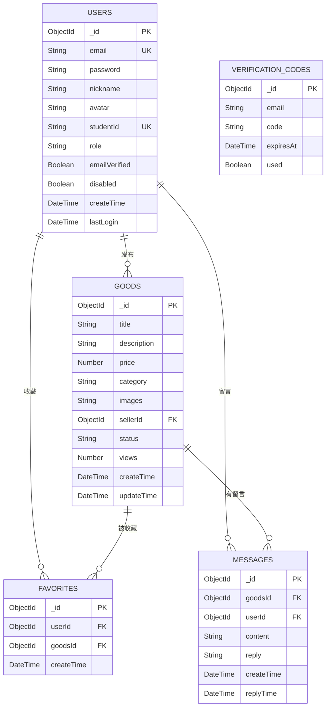

### 10.3 ER关系说明

| 关系 | 说明 | 基数 |
|------|------|------|
| 用户 - 商品 | 用户发布商品 | 1:N |
| 用户 - 收藏 | 用户收藏商品 | 1:N |
| 用户 - 留言 | 用户发布留言 | 1:N |
| 商品 - 收藏 | 商品被收藏 | 1:N |
| 商品 - 留言 | 商品有留言 | 1:N |

### 10.4 数据库操作示例

#### 10.4.1 查询商品列表（分页+筛选）
```javascript
db.goods.find({ 
  status: 'on',
  category: '电子产品',
  price: { $gte: 100, $lte: 1000 }
})
.sort({ createTime: -1 })
.skip((page - 1) * pageSize)
.limit(pageSize)
.populate('sellerId', 'nickname avatar')
```

#### 10.4.2 查询用户收藏
```javascript
db.favorites.find({ userId: ObjectId('xxx') })
.sort({ createTime: -1 })
.populate('goodsId', 'title price images category')
```

#### 10.4.3 查询商品留言
```javascript
db.messages.find({ goodsId: ObjectId('xxx') })
.sort({ createTime: -1 })
.populate('userId', 'nickname avatar')
```

### 10.5 数据字典

#### 10.5.1 用户角色枚举
| 值 | 说明 |
|----|------|
| guest | 游客（未注册） |
| student | 学生用户（已注册/认证） |
| admin | 管理员 |

#### 10.5.2 商品状态枚举
| 值 | 说明 |
|----|------|
| on | 上架中 |
| off | 已下架 |
| sold | 已售出 |

#### 10.5.3 商品分类枚举
| 值 | 说明 |
|----|------|
| 书籍 | 图书教材 |
| 电子产品 | 数码设备 |
| 生活用品 | 日常用品 |
| 其他 | 其他类别 |

### 10.6 数据安全与合规

#### 10.6.1 加密存储
- **密码**：使用 bcrypt 或 argon2 加密存储
- **敏感字段**：手机号、微信号等敏感信息可考虑脱敏存储

#### 10.6.2 访问控制
| 角色 | 用户表 | 商品表 | 收藏表 | 留言表 |
|------|--------|--------|--------|--------|
| 游客 | 只读(公开) | 只读(公开) | 无 | 只读(公开) |
| 学生 | 读写(本人) | 读写(本人) | 读写(本人) | 读写(本人) |
| 管理员 | 读写(全部) | 读写(全部) | 只读 | 读写(全部) |

#### 10.6.3 数据清理策略
- **验证码**：超过过期时间自动删除
- **软删除**：商品/留言支持软删除而非物理删除
- **日志保留**：操作日志保留90天

### 10.7 性能优化建议

1. **索引优化**：根据查询频率添加复合索引
2. **数据分片**：当数据量较大时考虑分片存储
3. **缓存策略**：热门商品数据缓存到 Redis
4. **读写分离**：主从复制，读操作走从库

---

**文档版本**: v1.0  
**生成日期**: 2026-05-16  
**适用项目**: 校园二手交易平台
