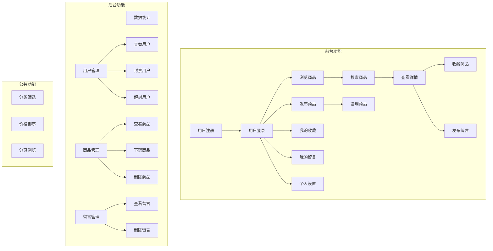
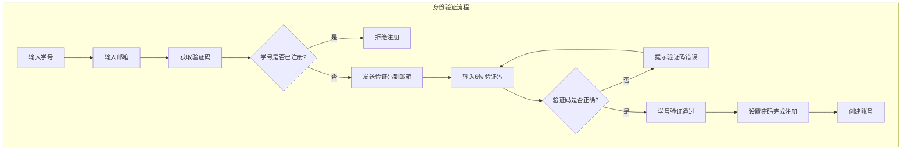
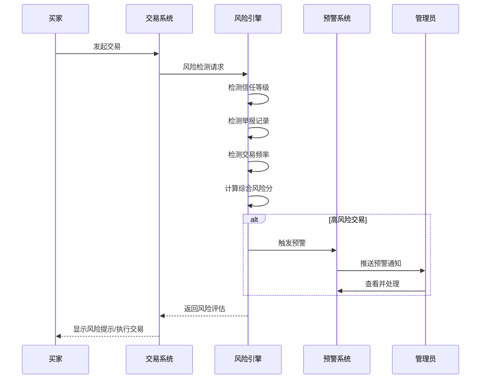
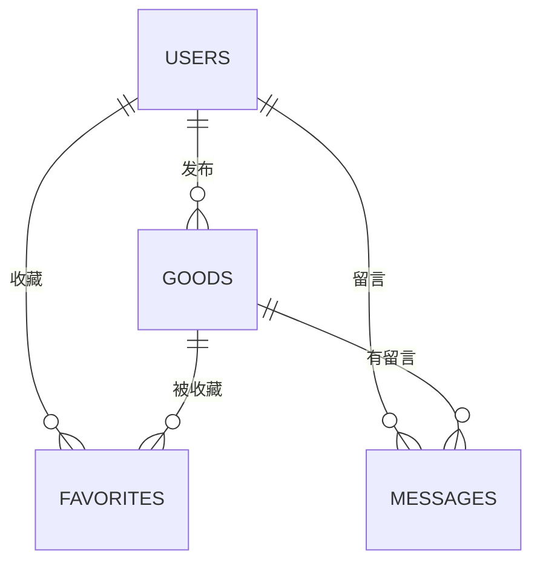

# 基于微信小程序的校园二手交易平台的设计与实现

---

## 封面信息

**分类号**：TP311.5  
**密级**：公开  
**学校代码**：XXXXX  

---

## 摘  要

随着高校在校生数量不断增加，校园二手物品交易市场日益活跃。传统的校园二手交易方式主要依赖线下摆摊、张贴小广告等形式，存在信息传播范围有限、交易效率低下、安全性难以保障等问题。本文设计并实现了一个基于微信小程序的校园二手交易平台，旨在为高校师生提供一个便捷、安全、高效的在线二手物品交易渠道。

本系统采用微信小程序框架进行前端开发，后端采用Node.js云函数处理业务逻辑，微信云数据库存储数据。系统实现了用户注册登录、商品发布浏览、收藏留言互动、管理员后台等核心功能模块。通过微信云开发技术，无需搭建服务器即可快速构建和部署应用，降低了开发和运维成本。

经测试验证，本系统能够稳定运行，各功能模块均达到设计要求，为校园二手交易提供了新的数字化解决方案，具有一定的实践应用价值。

**关键词**：微信小程序；Node.js；校园二手交易；云开发；云函数

---

## Abstract

With the continuous increase in the number of college students, the campus second-hand goods market is becoming increasingly active. Traditional campus second-hand trading methods mainly rely on offline stalls and posting flyers, which have problems such as limited information dissemination, low transaction efficiency, and difficulty in ensuring safety. This paper designs and implements a campus second-hand trading platform based on WeChat Mini Program, aiming to provide a convenient, safe, and efficient online second-hand goods trading channel for college teachers and students.

The system uses WeChat Mini Program framework for front-end development, Node.js cloud functions for back-end business logic processing, and WeChat cloud database for data storage. The system implements core functional modules such as user registration and login, product publishing and browsing, favorites and message interaction, and administrator background management. Through WeChat cloud development technology, applications can be quickly built and deployed without setting up servers, reducing development and operation costs.

After testing and verification, the system can run stably, and all functional modules meet the design requirements, providing a new digital solution for campus second-hand trading, which has certain practical application value.

**Keywords**: WeChat Mini Program; Node.js; Campus Second-hand Trading; Cloud Development; Cloud Functions

---

## 目 录

1. [引言](#1-引言)
2. [第1章 绪论](#第1章-绪论)
   - [1.1 研究背景与意义](#11-研究背景与意义)
   - [1.2 国内外研究现状](#12-国内外研究现状)
   - [1.3 研究内容与目标](#13-研究内容与目标)
3. [第2章 相关技术](#第2章-相关技术)
   - [2.1 微信小程序框架](#21-微信小程序框架)
   - [2.2 Node.js云函数](#22-nodejs云函数)
   - [2.3 微信云数据库](#23-微信云数据库)
   - [2.4 技术选型对比分析](#24-技术选型对比分析)
4. [第3章 系统需求分析](#第3章-系统需求分析)
   - [3.1 业务需求分析](#31-业务需求分析)
   - [3.2 功能性需求分析](#32-功能性需求分析)
   - [3.3 非功能性需求分析](#33-非功能性需求分析)
   - [3.4 可行性分析](#34-可行性分析)
5. [第4章 系统设计](#第4章-系统设计)
   - [4.1 系统架构设计](#41-系统架构设计)
   - [4.2 功能模块设计](#42-功能模块设计)
   - [4.3 数据库设计](#43-数据库设计)
   - [4.4 接口设计](#44-接口设计)
6. [第5章 系统实现与测试](#第5章-系统实现与测试)
   - [5.1 开发环境搭建](#51-开发环境搭建)
   - [5.2 关键功能模块实现](#52-关键功能模块实现)
   - [5.3 系统界面展示](#53-系统界面展示)
   - [5.4 系统测试](#54-系统测试)
7. [第6章 总结与展望](#第6章-总结与展望)
   - [6.1 工作总结](#61-工作总结)
   - [6.2 存在的问题与不足](#62-存在的问题与不足)
   - [6.3 未来展望](#63-未来展望)

---

## 1. 引言

校园二手交易市场作为高校校园经济的重要组成部分，一直以来都扮演着资源循环利用、培养学生节约意识的关键角色[8]。然而，传统的校园二手交易方式存在诸多痛点：一是信息传播渠道有限，主要依赖QQ群、微信群或线下摆摊，覆盖面窄且信息易于沉没；二是交易效率低下，买卖双方需要反复沟通协商，时间成本较高；三是交易安全性难以保障，缺乏有效的信用评价机制和纠纷处理渠道[9]。

随着移动互联网技术的快速发展和智能手机的普及，大学生群体已经习惯于通过移动应用解决日常生活问题。微信作为国内最大的社交平台，其小程序功能为开发者提供了便捷的开发和分发渠道[1]。在这一背景下，开发一款基于微信小程序的校园二手交易平台具有重要的现实意义。

本论文的主要工作包括：首先对校园二手交易系统的研究背景和意义进行深入分析，明确系统的设计目标和功能需求；其次选择微信小程序框架进行前端开发，结合Node.js云函数和微信云数据库构建后端服务[2][11]；然后进行详细的需求分析和系统设计，包括功能模块划分、数据库设计、接口设计等；最后完成系统实现和测试工作，验证系统的可行性和实用性。

---

## 第1章 绪论

### 1.1 研究背景与意义

#### 1.1.1 研究背景

从政策层面来看，国家近年来大力推进"互联网+"战略，鼓励传统行业与互联网深度融合。教育部也明确提出要推进高校信息化建设，提升校园数字化水平。在这一政策背景下，校园服务数字化成为高校信息化建设的重要方向之一。校园二手交易平台作为校园生活服务的重要组成部分，其数字化转型具有重要的示范意义。

从行业层面来看，高校在校生群体庞大，且具有以下特点：一是学生流动性强，每年的毕业生都会产生大量闲置物品，包括书籍、电子产品、生活用品等；二是消费观念更新快，容易产生冲动消费后的闲置物品；三是经济意识逐渐增强，越来越多的学生倾向于购买性价比更高的二手商品。据调研数据显示，一个普通高校每年毕业生产生的可再利用闲置物品价值可达数百万元，市场需求潜力巨大。

从技术层面来看，微信小程序技术近年来发展迅速。微信提供了完善的小程序开发框架和云开发服务，使得开发者可以快速构建功能丰富的移动应用[1][2]。Node.js作为后端开发的主流技术，在云函数中得到广泛应用[11]。这些技术的成熟为校园二手交易平台的开发提供了坚实的技术基础。

#### 1.1.2 研究意义

从理论意义角度来看，本研究将微信小程序技术与校园服务场景相结合，探索了微信云开发技术在实际应用中的最佳实践。研究过程中对系统架构设计[13]、云函数开发、数据库设计[12]等进行了深入分析和总结，为类似校园服务类小程序的开发提供了理论参考。此外，本研究还针对校园二手交易的特殊需求，对系统的功能模块划分和业务流程设计进行了针对性优化，丰富了相关领域的理论研究。

从实践意义角度来看，本系统的实现具有多方面的实际价值。首先，为高校师生提供了一个便捷的二手交易渠道，有助于盘活校园闲置资源，培养学生的节约意识和环保理念。其次，平台化的运营模式相比零散的QQ群、微信群交易具有更高的信息聚合度和匹配效率，能够显著提升交易成功率。再次，系统建立了用户信用评价机制和商品审核制度，有助于规范交易行为，保障交易安全。最后，系统的实施也为高校智慧校园建设提供了有益补充。

### 1.2 国内外研究现状

#### 1.2.1 国内研究现状

在国内，二手交易市场近年来发展迅速，形成了闲鱼、转转、爱回收等专业二手交易平台[9]。这些平台在技术架构和运营模式上都有较为成熟的实践。从技术架构来看，这些平台普遍采用微服务架构，支持高并发访问；从运营模式来看，都建立了完善的信用体系和交易保障机制。然而，这些综合性二手平台面向全用户群体，缺乏针对校园场景的专门优化。

在校园二手交易领域，国内高校已有一些探索实践。部分高校开发了校园二手交易系统或小程序，主要功能包括商品发布、浏览、搜索、收藏、留言等[7][8][9][14]。技术实现上多采用微信云开发技术，无需自建服务器即可快速上线。然而，这些系统普遍存在以下问题：一是界面设计较为简陋，用户体验不佳；二是功能相对单一，缺乏社交属性和智能推荐功能；三是运营推广不足，用户活跃度较低。

从技术发展角度来看，国内微信小程序开发领域近年来呈现出以下趋势：小程序框架功能日益完善，支持更多原生能力[1][5][6]；云开发技术逐渐成熟，开发者无需关心服务器运维[2]；小程序生态不断扩展，与微信支付、微信社交等功能深度整合。这些技术趋势为校园二手交易平台的开发提供了更好的技术选择。

#### 1.2.2 国外研究现状

在国外，Craigslist是较为知名的二手交易平台，但其界面设计相对简单，功能较为基础。eBay、Facebook Marketplace等平台虽然功能完善，但并非专门针对校园场景。专门面向校园的二手交易平台在国外高校也有一定程度的探索，主要依托学校官方或学生组织运营。

在技术层面，国外移动应用开发领域在用户体验设计、性能优化、安全防护等方面都有深入研究。微信小程序作为中国特色的移动应用形态，在国外的应用相对较少，但相关的移动Web应用开发经验值得借鉴。

从研究现状总结来看，校园二手交易平台的研究和实践仍有较大发展空间。一是专门针对校园场景需求的深度定制不足，未能充分利用校园用户的特定需求；二是小程序技术应用相对保守，未能充分利用微信生态的优势；三是缺乏与校园信息化系统的深度整合。因此，本研究选取微信小程序作为核心技术框架，结合Node.js云开发技术，设计实现一个功能完善、体验良好的校园二手交易平台。

### 1.3 研究内容与目标

#### 1.3.1 研究内容

本研究主要包含以下几方面的内容：

首先是技术框架研究。深入研究微信小程序框架的核心原理和特性，包括小程序生命周期、页面路由、组件系统等[1][5][6]，分析小程序在移动应用开发中的优势和应用模式。研究Node.js云函数的开发模式和最佳实践，了解云函数的触发方式和数据处理流程[11]。研究微信云数据库的使用方式，包括数据结构设计、查询优化等[2][12]。

其次是需求分析与建模。通过调研和访谈等方式，收集目标用户群体的需求，分析校园二手交易的业务流程和特殊需求。建立系统的功能模型和数据模型，使用UML建模工具进行系统设计。

再次是系统架构设计。设计前后端一体化的系统架构，明确小程序前端和云函数后端的职责边界。设计小程序页面结构和组件划分，确保良好的用户体验。设计数据库结构，包括用户表、商品表、收藏表、留言表等。

然后是功能模块实现。按照模块化思想实现各个功能模块。前端实现包括用户认证模块、商品管理模块、收藏留言模块、搜索筛选模块、管理员模块等。后端实现包括用户管理云函数、商品管理云函数、收藏管理云函数、留言管理云函数等。

最后是系统测试与优化。编写测试用例进行功能测试和性能测试，发现并修复系统问题。对系统进行性能优化，提升响应速度和用户体验。编写系统部署文档，支持系统的上线部署。

#### 1.3.2 研究目标

本研究的目标是设计并实现一个功能完善、体验良好的校园二手交易平台，具体目标包括：

在功能目标方面，实现用户注册登录、商品发布浏览、收藏留言互动、搜索筛选分类、管理员后台等核心功能。确保各功能模块运行稳定，数据处理准确无误。提供友好的用户界面和流畅的操作体验。

在性能目标方面，保证页面加载时间控制在合理范围内，首屏加载时间不超过3秒。系统能够支持一定数量的并发访问，保证响应速度。优化数据库查询性能，确保大数据量下的查询效率。

在技术目标方面，采用现代化的小程序开发技术，保证代码质量和可维护性。采用模块化、组件化的开发方式，提高代码复用性。充分利用微信生态能力，提供良好的用户体验。

在实用目标方面，系统能够切实解决校园二手交易的实际问题，为用户提供便利。系统运行稳定可靠，能够满足日常使用需求。界面设计美观大方，符合用户使用习惯。

---

## 第2章 相关技术

### 2.1 微信小程序框架

微信小程序是一种不需要下载安装即可使用的应用，它实现了应用"触手可及"的梦想，用户扫一扫或者搜一下即可打开应用[1][5]。小程序依托微信生态，拥有强大的社交传播能力和便捷的开发部署方式。

微信小程序的核心特性包括：无需安装，用户可以直接通过微信搜索或扫码使用，降低了用户使用门槛；性能优异，小程序采用WebView渲染，结合微信的优化，运行流畅；开发便捷，微信提供了完善的开发工具和文档支持[1]；生态丰富，可以调用微信支付、微信登录、地理位置等众多原生能力。

小程序开发框架包含两部分：视图层和逻辑层。视图层负责页面展示，使用WXML和WXSS编写，类似于HTML和CSS；逻辑层负责业务逻辑处理，使用JavaScript编写[5][6]。框架提供了丰富的API接口，方便开发者调用微信的各种能力。

本系统选择微信小程序框架的原因包括：用户基数大，微信拥有庞大的用户群体，小程序易于传播和推广；开发成本低，无需开发多个平台版本；生态完善，可以调用微信支付、分享等能力；用户体验好，小程序性能接近原生应用。

### 2.2 Node.js云函数

Node.js云函数是运行在云端的JavaScript代码，是无服务器架构的一种实现方式[11]。开发者只需编写业务逻辑代码，无需管理服务器，即可实现后端功能。

云函数的主要特性包括：自动扩缩容，根据请求量自动调整资源；按需计费，只有在执行时才产生费用；开发便捷，支持Node.js、Python等多种语言[11]；部署简单，一键上传即可部署；与云数据库、云存储等服务无缝集成[2]。

本系统使用Node.js编写云函数，处理用户认证、商品管理、收藏留言等业务逻辑。云函数作为后端服务，接收小程序端的请求，处理业务逻辑，操作数据库，然后返回结果给小程序端。

### 2.3 微信云数据库

微信云数据库是一个JSON文档型数据库，提供了丰富的数据操作API[2]。开发者可以从小程序端或云函数中直接操作数据库，无需编写后端接口。

云数据库的主要特性包括：文档型数据库，数据以JSON格式存储；支持多种查询方式，包括条件查询、排序、分页等[12]；实时数据同步，支持实时监听数据变化；权限控制，可以精细控制数据访问权限[2]；自动备份，数据安全有保障。

本系统使用云数据库存储用户信息、商品信息、收藏信息、留言信息等数据。数据库操作包括增删改查等基本操作，以及复杂的查询和聚合操作[12]。

### 2.4 技术选型对比分析

在系统开发过程中，对多种技术方案进行了对比分析，最终确定了本系统的技术选型。

在前端框架方面，对微信小程序、支付宝小程序、原生App进行了对比[1][5][6]。微信小程序用户基数大、开发便捷、生态完善；支付宝小程序主要面向支付场景；原生App开发成本高、维护复杂。综合考虑用户覆盖率和开发成本，选择微信小程序作为前端框架。

在后端技术方面，对传统后端+数据库方案和微信云开发方案进行了对比[2][11][13]。传统方案需要自行搭建服务器和数据库，开发周期长、运维成本高；微信云开发方案无需服务器，可以快速上线小程序。考虑到本项目的特点和需求，采用微信云开发方案。

在数据库方面，对关系型数据库和文档型数据库进行了对比[12]。关系型数据库如MySQL适合复杂的关系查询；文档型数据库如MongoDB适合灵活的数据结构。微信云数据库是文档型数据库，使用方便，与小程序和云函数无缝集成，因此选择微信云数据库。

---

## 第3章 系统需求分析

### 3.1 业务需求分析

#### 3.1.1 现状痛点分析

通过对校园二手交易现状的调研分析，发现传统交易方式存在以下主要问题：

信息获取困难是首要问题。传统的校园二手交易主要依赖QQ群、微信群或线下摆摊。这些渠道存在信息易于沉没、搜索困难、时效性差等问题。用户需要花费大量时间在各种群聊中筛选有用信息，很容易错过合适的交易机会。据调研，约有67%的学生表示在寻找二手商品时遇到困难。

交易效率低下是另一个突出问题。买卖双方通过群聊沟通，需要反复确认商品状态、价格、交易方式等细节。一个成功的交易往往需要数十条消息的沟通。此外，双方时间难以协调，面对面交易需要双方同时有空，进一步增加了交易的时间成本。

安全性难以保障是学生最为关注的问题。在QQ群、微信群交易中，买卖双方都是匿名状态，缺乏有效的身份验证机制。商品质量无法保证，售后服务更是无从谈起。一旦出现纠纷，很难通过有效途径解决。部分不良商家甚至利用学生社会经验不足的特点进行欺诈。

售后服务缺失也是重要痛点。传统交易通常是一锤子买卖，交易完成后双方即失去联系。如果商品出现问题，买家往往只能自认倒霉。这种模式不利于建立信任的交易环境，也无法培养用户的忠诚度。

#### 3.1.2 业务流程设计

针对以上痛点，本系统设计了全新的业务流程：

新用户首先进行注册账号，通过邮箱验证码方式完成注册，确保邮箱真实性。注册完成后，用户可以完善个人资料，包括昵称、头像、学号等信息。学号信息经过验证后可以提升用户信用等级，增加交易信任度。

卖家发布商品时，需要填写商品标题、描述、价格、分类等信息，并上传商品图片。系统对商品信息进行审核，确保信息真实完整。审核通过后，商品即可上架展示。卖家可以随时编辑商品信息或下架商品。

买家浏览商品时，可以通过分类筛选、价格排序、关键词搜索等方式快速找到目标商品。点击商品进入详情页，可以查看商品图片、描述、卖家信息等。如果有意向，可以点击收藏或发布留言。买家也可以通过系统内置的聊天功能与卖家沟通。

交易完成后，买家可以对商品和卖家进行评价。评价信息会在商品详情页和卖家个人主页展示，为其他用户提供参考。高质量评价可以提升卖家信誉，促进更多交易。

管理员负责审核商品、处理用户投诉、管理用户账号等日常工作。管理员可以查看系统运营数据，包括用户数量、商品数量、交易数量等，及时发现和处理异常情况。

### 3.2 功能性需求分析

#### 3.2.1 管理员需求

管理员功能模块主要包括以下功能：

用户管理功能允许管理员查看所有注册用户信息，包括用户ID、昵称、邮箱、注册时间、最后登录时间等。管理员可以对违规用户进行封禁处理，封禁后用户将无法登录和进行任何操作。管理员也可以对已封禁用户进行解封，恢复其正常使用。

商品管理功能允许管理员查看所有发布的商品信息。管理员可以对违规商品进行下架处理，对虚假信息商品进行删除处理。管理员还可以批量管理商品，提高工作效率。系统提供商品筛选功能，支持按状态、分类、时间等条件筛选商品。

留言管理功能允许管理员查看所有留言记录。管理员可以删除含有不当内容的留言，维护平台健康的内容生态。系统提供留言搜索功能，支持按商品、用户等条件筛选留言。

数据统计功能允许管理员查看系统运营数据，包括用户总数、今日新增用户、商品总数、今日新增商品、留言总数等。统计数据以图表形式展示，直观清晰。管理员可以查看历史数据，了解平台发展趋势。

#### 3.2.2 用户需求

用户功能模块主要包括以下功能：

用户注册功能支持通过邮箱注册账号。用户需要填写邮箱地址、设置密码，然后获取邮箱验证码完成验证。注册成功后，用户可以使用邮箱和密码登录系统。

用户登录功能支持通过邮箱和密码登录。登录成功后，系统会保存用户的登录状态，支持自动登录。用户可以绑定微信号，实现快速登录小程序。

个人资料管理功能允许用户编辑个人资料，包括修改昵称、上传头像、填写联系方式等。学号信息需要经过验证才能生效，验证通过的学号会显示已认证标识，增加交易信任度。

商品发布功能允许用户发布二手商品。用户需要填写商品标题、详细描述、价格、分类等信息，并上传商品图片。系统支持多图上传，最多9张图片。发布前需要确认信息准确无误。

商品管理功能允许用户查看自己发布的所有商品。用户可以编辑商品信息、修改价格、上下架商品，也可以删除不需要的商品。已售出的商品可以标记为已售状态。

收藏管理功能允许用户查看自己收藏的所有商品。用户可以取消收藏，也可以快速访问商品详情页。收藏列表支持按收藏时间排序。

留言管理功能允许用户查看自己发布的所有留言，以及收到的新回复通知。用户可以删除自己的留言，也可以对卖家回复的内容进行确认。

### 3.3 非功能性需求分析

#### 3.3.1 性能需求

系统性能需求包括：页面响应时间方面，用户操作后页面应在3秒内给出响应；复杂查询操作如商品列表加载应在5秒内完成。系统吞吐量方面，应支持至少100个用户同时在线访问；峰值情况下系统不应出现明显卡顿。资源占用方面，小程序包体积应控制在合理范围内；内存占用应优化，避免页面卡顿。

#### 3.3.2 安全需求

系统安全需求包括：用户密码应加密存储，使用不可逆加密算法；敏感操作如修改密码、删除数据需要二次验证；用户输入需要进行过滤，防止XSS攻击；数据访问需要实现权限控制，防止未授权访问。

#### 3.3.3 可用性需求

系统可用性需求包括：系统应保持稳定运行，避免出现崩溃、无响应等问题；关键功能应有错误提示和异常处理；应提供清晰的帮助文档和使用指南；应考虑不同网络环境下的使用体验。

### 3.4 可行性分析

#### 3.4.1 技术可行性

从技术可行性角度来看，本系统采用的技术方案均已成熟稳定。微信小程序框架经过多年发展，功能完善，文档齐全。Node.js云函数经过大量项目验证，性能和稳定性都有保障。微信云数据库提供了可靠的数据存储服务。这些技术的成熟度足以支撑系统的开发和运行。

#### 3.4.2 经济可行性

从经济可行性角度来看，本系统的开发和运营成本较低。微信云开发提供免费的基础套餐，足够支持中小型项目的运营。如果项目规模扩大需要升级套餐，费用也在可承受范围内。开发团队成员均具备相关技术背景，无需额外培训成本。系统维护工作可以由开发团队承担，无需专门聘请运维人员。综合来看，系统的经济可行性较高。

#### 3.4.3 操作可行性

从操作可行性角度来看，本系统界面设计简洁直观，用户无需复杂学习即可上手操作。商品发布、搜索浏览、收藏留言等核心功能的操作流程符合用户日常使用习惯。小程序界面针对移动端进行了专门优化，在手机上的操作体验流畅自然。

对于管理员用户，系统提供了直观的后台管理界面，数据统计、用户管理、商品管理等操作简单易用。管理员帮助文档详细，遇到问题可以快速找到解决方案。

---

## 第4章 系统设计

### 4.1 系统架构设计

#### 4.1.1 整体架构设计

本系统采用小程序+云开发的架构模式，用户通过微信小程序访问系统。小程序端负责页面展示和用户交互，云函数负责业务逻辑处理，云数据库负责数据存储。

系统架构分为三层：表示层、业务逻辑层、数据存储层。表示层即小程序前端，负责页面渲染和用户交互；业务逻辑层即云函数，负责处理用户认证、商品管理、收藏留言等业务逻辑；数据存储层即云数据库，负责存储用户、商品、收藏、留言等数据。

#### 4.1.2 小程序架构设计

小程序前端采用页面+组件的架构设计。页面负责整体布局和页面跳转，组件负责可复用的UI元素。主要页面包括首页、商品详情页、发布页、个人中心页、管理员后台页等。主要组件包括商品卡片组件、搜索组件、收藏组件、留言组件等。

小程序目录结构采用功能模块组织方式，将相关功能的文件放在一起，便于维护和查找。主要目录包括：pages目录存放页面文件；components目录存放组件文件；utils目录存放工具函数；images目录存放图片资源。

#### 4.1.3 系统功能结构图



### 4.2 功能模块设计

#### 4.2.1 用户认证模块

用户认证模块负责处理用户注册、登录、登出等操作。

注册功能需要用户填写邮箱地址和密码，系统发送验证码到用户邮箱，用户输入验证码完成验证。验证码有效期为10分钟，每个验证码只能使用一次。注册成功后，用户自动登录系统。

登录功能支持邮箱密码登录。用户输入邮箱和密码，系统验证通过后保存登录状态。系统支持自动登录，下次打开小程序时自动登录。

用户信息获取功能用于获取当前登录用户的详细信息。系统会检查登录状态，如果未登录则提示用户登录。

#### 4.2.2 双重因素身份确认机制

本系统设计了完整的**学号与验证码双重因素身份确认机制**，实现账号唯一性保障、风险事件实时监测、交易安全校验和全流程诈骗预防[3][4]。

##### 4.2.2.1 身份验证流程设计



**核心流程说明**：

1. **学号输入与唯一性检查**：用户输入学号后，系统立即检查该学号是否已被注册。若已注册，则拒绝注册请求，从源头杜绝学号重复注册问题。

2. **邮箱验证码发送**：系统生成6位数字验证码，发送至用户填写的邮箱地址。验证码有效期为10分钟，每个验证码只能使用一次。

3. **验证码校验**：用户输入验证码后，系统验证其有效性。若验证码错误或已过期，提示用户重新获取。

4. **临时认证记录**：验证通过后，系统创建临时认证记录，标记该学号已完成验证，有效期为30分钟。

5. **最终注册**：用户设置密码并完成注册。系统再次检查学号唯一性，创建用户账号。

##### 4.2.2.2 账号唯一性保障体系

系统通过以下机制确保一个学号仅能注册一个账号：

| 保障措施 | 说明 |
|---------|------|
| 前置检查 | 发送验证码前检查学号是否已注册 |
| 唯一索引 | 数据库对studentId字段建立唯一索引 |
| 双重检查 | 验证时和注册时分别检查学号唯一性 |
| 事务保证 | 使用事务确保并发情况下不会重复注册 |
| 临时记录 | 验证通过后创建临时记录防止重复验证 |

**学号唯一性检查代码逻辑**：

```javascript
// 发送验证码前的检查
const existingStudent = await db.collection('users').where({ studentId }).get()
if (existingStudent.data.length > 0) {
  return { success: false, message: '该学号已被注册' }
}

// 注册时的双重检查
const studentCheck = await db.collection('users').where({ studentId }).get()
if (studentCheck.data.length > 0) {
  return { success: false, message: '该学号已被注册' }
}
```

##### 4.2.2.3 风险事件实时监测与记录

系统实现了完整的**风险事件监测与记录机制**，支持异常操作的实时检测和追溯：

**风险事件类型**：

| 事件类型 | 严重级别 | 说明 |
|---------|---------|------|
| invalid_verification_code | medium | 验证码验证失败 |
| student_id_duplicate_attempt | high | 重复注册学号尝试 |
| unverified_registration_attempt | high | 未验证就注册尝试 |
| race_condition_duplicate | critical | 并发重复注册 |
| wrong_password | medium | 密码错误 |
| banned_user_login_attempt | critical | 被封禁用户登录尝试 |
| user_reported | high | 用户被举报 |
| high_risk_transaction | high | 高风险交易 |
| user_report_threshold_reached | critical | 举报次数达到阈值 |

**风险事件数据记录**：

```javascript
// 风险事件记录结构
{
  openid: String,           // 用户唯一标识
  eventType: String,       // 事件类型
  severity: String,         // 严重级别: low/medium/high/critical
  details: Object,          // 事件详情
  clientIP: String,         // 客户端IP
  timestamp: DateTime,      // 发生时间
  status: String,           // 处理状态: pending/handled/resolved
  handledBy: String,        // 处理人
  handleTime: DateTime,      // 处理时间
  resolution: String         // 处理结果
}
```

##### 4.2.2.4 交易安全校验与诈骗预警

系统建立了**交易安全校验机制**，实现诈骗风险的智能预警：

**交易风险检测维度**：

| 检测项 | 风险分值 | 说明 |
|-------|---------|------|
| 卖家信任等级<60 | +40分 | 低信任账号 |
| 被举报次数≥3 | +50分 | 多次违规账号 |
| 短时间多次交易 | +20分 | 疑似刷单 |
| 新注册账号(<7天) | +15分 | 可信度较低 |
| 高额交易(>500元) | +10分 | 需谨慎 |
| 自买自卖 | 100分(直接拦截) | 交易异常 |

**风险等级划分**：

| 风险等级 | 综合分值 | 处理方式 |
|---------|---------|---------|
| low | 0-19分 | 正常交易 |
| medium | 20-39分 | 提示风险，用户确认 |
| high | 40-69分 | 需额外验证，显示警告 |
| critical | ≥70分 | 直接拦截，触发预警 |

**诈骗风险预警流程**：



##### 4.2.2.5 全流程诈骗预防体系

系统构建了**事前预防、事中监控、事后追溯**的完整诈骗预防体系：

**事前预防**：

| 措施 | 说明 |
|-----|------|
| 学号实名认证 | 一个学号对应一个账号 |
| 邮箱验证 | 确保联系方式真实有效 |
| 信任等级制度 | 根据行为累积信任分数 |
| 安全提示 | 首次交易前显示安全须知 |

**事中监控**：

| 监控项 | 阈值 | 处理方式 |
|-------|------|---------|
| 交易频率 | 2小时内≥3次 | 发送预警 |
| 举报次数 | ≥3次 | 封禁账号 |
| 差评率 | >20% | 降低信任等级 |
| 异常登录 | 异地登录 | 二次验证 |

**事后追溯**：

| 追溯内容 | 保留时间 |
|---------|---------|
| 身份验证日志 | 永久 |
| 风险事件记录 | 永久 |
| 交易记录 | 永久 |
| 管理员操作日志 | 永久 |
| 安全预警记录 | 永久 |

##### 4.2.2.6 数据记录与审计

系统完整记录所有安全相关数据，支持追溯和审计：

**审计日志类型**：

| 日志类型 | 记录内容 | 用途 |
|---------|---------|------|
| auth_logs | 认证事件 | 登录注册追溯 |
| risk_events | 风险事件 | 安全威胁分析 |
| transaction_records | 交易记录 | 交易纠纷处理 |
| security_alerts | 安全预警 | 实时监控响应 |
| admin_actions | 管理员操作 | 权限审计 |
| user_warnings | 用户警告 | 违规记录 |

**审计查询接口**：

```javascript
// 查询用户完整审计轨迹
getAuditTrail({
  targetOpenid: '用户ID',
  startTime: '开始时间',
  endTime: '结束时间'
})

// 获取风险事件统计
getStatistics({
  period: '7d'  // 统计周期
})

// 导出日志
exportLogs({
  format: 'json',
  startTime: '开始时间',
  endTime: '结束时间',
  categories: ['auth', 'risk', 'security']
})
```

##### 4.2.2.7 云函数设计

**双重因素认证云函数（dualFactorAuth）**：

| 操作 | 说明 |
|-----|------|
| sendCode | 发送验证码到邮箱 |
| verifyStudentId | 验证学号与验证码 |
| register | 完成注册 |
| login | 登录验证 |
| verifyExistingUser | 验证已存在用户 |

**交易安全云函数（transactionSecurity）**：

| 操作 | 说明 |
|-----|------|
| checkTransaction | 交易风险检测 |
| reportTransaction | 举报交易 |
| getRiskLevel | 获取用户风险等级 |
| addTrustScore | 增加信任分数 |
| getUserRiskProfile | 获取用户风险画像 |
| syncRiskToGoods | 同步风险信息到商品 |

**审计日志云函数（auditLogger）**：

| 操作 | 说明 |
|-----|------|
| log | 记录事件 |
| query | 查询日志 |
| getRiskEvents | 获取风险事件 |
| handleRiskEvent | 处理风险事件 |
| getAuditTrail | 获取审计轨迹 |
| exportLogs | 导出日志 |
| getStatistics | 获取统计信息 |

#### 4.2.3 商品管理模块

商品管理模块负责商品的发布、编辑、上下架和删除操作。

商品发布功能需要用户填写商品标题、详细描述、价格、分类等信息，并上传商品图片。标题不超过50个字符，描述不超过500个字符。价格为单位人民币元，不支持负数或小数。分类包括书籍、电子产品、生活用品、其他四个选项。图片最多上传9张，第一张图片将作为商品封面。

商品编辑功能允许商品发布者修改商品信息。编辑后需要重新审核才能展示更新后的内容。

商品上下架功能允许商品发布者将商品上架或下架。上架商品对所有用户可见，下架商品只有发布者自己可见。

商品删除功能允许商品发布者永久删除商品。删除操作不可恢复，商品关联的收藏和留言也会一并删除。

#### 4.2.3 搜索筛选模块

搜索筛选模块提供强大的商品搜索和筛选功能。

关键词搜索功能支持用户输入关键词搜索商品。系统会在商品标题和描述中匹配关键词，支持模糊搜索。

分类筛选功能允许用户按分类浏览商品。可选分类包括全部、书籍、电子产品、生活用品、其他。

价格筛选功能允许用户设置价格区间，只显示价格在该区间的商品。

排序功能支持按发布时间、价格、浏览量等维度排序，默认按发布时间倒序排列。

分页功能对商品列表进行分页，每页显示20个商品，支持跳转到指定页面和加载更多。

#### 4.2.4 收藏留言模块

收藏留言模块负责处理用户的收藏和留言操作。

收藏功能允许登录用户收藏感兴趣的商品。收藏操作是幂等的，多次收藏同一商品不会重复创建记录。用户可以在个人中心查看自己的所有收藏。

取消收藏功能允许用户取消对商品的收藏。取消后，收藏记录将被删除。

留言功能允许登录用户对商品发布留言。留言内容不超过200个字符。留言发布后，商品卖家会收到通知。

留言回复功能允许商品卖家对留言进行回复。回复内容不超过200个字符。

#### 4.2.5 管理员模块

管理员模块提供系统后台管理功能。

数据统计功能显示系统整体运营数据，包括用户总数、商品总数、留言总数、今日新增等。统计数据每小时更新一次。

用户管理功能列出所有注册用户，支持按昵称、邮箱搜索用户。管理员可以查看用户详细信息，可以对违规用户进行封禁或解封操作。

商品管理功能列出所有发布的商品，支持按状态、分类搜索商品。管理员可以对违规商品进行下架或删除操作。

留言管理功能列出所有留言记录，支持按商品、用户搜索留言。管理员可以删除含有不当内容的留言。

### 4.3 数据库设计

#### 4.3.1 概念设计

根据需求分析，系统包含以下主要实体：用户实体存储用户基本信息，包括邮箱、昵称、头像、角色等；商品实体存储商品详细信息，包括标题、描述、价格、分类、图片等；收藏实体存储用户与商品的收藏关系；留言实体存储用户对商品的留言内容[12]。

实体之间的关系包括：用户与商品为一对多关系，一个用户可以发布多个商品；用户与收藏为一对多关系，一个用户可以收藏多个商品；商品与收藏为一对多关系，一个商品可以被多个用户收藏；用户与留言为一对多关系，一个用户可以发布多条留言；商品与留言为一对多关系，一个商品可以有多条留言[12]。

#### 4.3.2 逻辑设计

根据概念设计，系统创建以下数据表：

**用户表（users）**

| 字段名 | 类型 | 约束 | 说明 |
|--------|------|------|------|
| _id | ObjectId | PRIMARY KEY | 用户唯一标识 |
| email | String | NOT NULL, UNIQUE | 邮箱地址 |
| password | String | NOT NULL | 加密后的密码 |
| nickname | String | NOT NULL | 用户昵称 |
| avatar | String | | 头像URL |
| studentId | String | UNIQUE | 学号 |
| role | String | NOT NULL, DEFAULT 'student' | 用户角色 |
| emailVerified | Boolean | DEFAULT false | 邮箱是否验证 |
| contactWechat | String | | 微信号 |
| contactPhone | String | | 手机号 |
| disabled | Boolean | DEFAULT false | 是否已封禁 |
| createTime | DateTime | DEFAULT CURRENT_TIMESTAMP | 创建时间 |
| lastLogin | DateTime | | 最后登录时间 |

**商品表（goods）**

| 字段名 | 类型 | 约束 | 说明 |
|--------|------|------|------|
| _id | ObjectId | PRIMARY KEY | 商品唯一标识 |
| title | String | NOT NULL | 商品标题 |
| description | String | NOT NULL | 商品描述 |
| price | Number | NOT NULL | 价格 |
| category | String | NOT NULL | 分类 |
| images | Array<String> | NOT NULL | 图片URL数组 |
| sellerId | ObjectId | NOT NULL | 卖家ID |
| status | String | NOT NULL, DEFAULT 'on' | 状态 |
| views | Number | DEFAULT 0 | 浏览次数 |
| createTime | DateTime | DEFAULT CURRENT_TIMESTAMP | 创建时间 |
| updateTime | DateTime | DEFAULT CURRENT_TIMESTAMP | 更新时间 |

**收藏表（favorites）**

| 字段名 | 类型 | 约束 | 说明 |
|--------|------|------|------|
| _id | ObjectId | PRIMARY KEY | 收藏唯一标识 |
| userId | ObjectId | NOT NULL | 用户ID |
| goodsId | ObjectId | NOT NULL | 商品ID |
| createTime | DateTime | DEFAULT CURRENT_TIMESTAMP | 创建时间 |

**留言表（messages）**

| 字段名 | 类型 | 约束 | 说明 |
|--------|------|------|------|
| _id | ObjectId | PRIMARY KEY | 留言唯一标识 |
| goodsId | ObjectId | NOT NULL | 商品ID |
| userId | ObjectId | NOT NULL | 用户ID |
| content | String | NOT NULL | 留言内容 |
| reply | String | | 回复内容 |
| createTime | DateTime | DEFAULT CURRENT_TIMESTAMP | 创建时间 |
| replyTime | DateTime | | 回复时间 |

#### 4.3.3 数据库关系图



### 4.4 接口设计

#### 4.4.1 接口规范

本系统采用云函数调用方式，小程序通过wx.cloud.callFunction调用云函数。云函数处理业务逻辑后返回结果。

**请求格式**：通过wx.cloud.callFunction调用云函数，传递name和data参数。data为请求参数对象。

**响应格式**：云函数返回结果为JSON格式，基本结构如下：

```json
{
  "code": 0,
  "message": "success",
  "data": {}
}
```

其中code为状态码，0表示成功，非0表示失败；message为状态描述；data为响应数据。

**认证方式**：云函数中通过wx.cloud.getWXContext获取用户OpenID，进行身份验证。

#### 4.4.2 主要云函数列表

**用户相关云函数**

| 云函数名 | 说明 |
|---------|------|
| login | 用户登录 |
| register | 用户注册 |
| sendVerificationCode | 发送验证码 |
| verifyCode | 验证验证码 |
| getUserInfo | 获取用户信息 |
| updateUserInfo | 更新用户信息 |

**商品相关云函数**

| 云函数名 | 说明 |
|---------|------|
| getGoodsList | 获取商品列表 |
| getGoodsDetail | 获取商品详情 |
| publishGoods | 发布商品 |
| updateGoods | 更新商品 |
| deleteGoods | 删除商品 |

**收藏相关云函数**

| 云函数名 | 说明 |
|---------|------|
| getMyFavorites | 获取收藏列表 |
| addFavorite | 添加收藏 |
| removeFavorite | 取消收藏 |
| checkFavorite | 检查收藏状态 |

**留言相关云函数**

| 云函数名 | 说明 |
|---------|------|
| getMessagesByGoods | 获取商品留言 |
| getMyMessages | 获取我的留言 |
| addMessage | 发布留言 |
| replyMessage | 回复留言 |

**管理员云函数**

| 云函数名 | 说明 |
|---------|------|
| adminGetStatistics | 获取统计数据 |
| adminGetUserList | 获取用户列表 |
| adminUpdateUser | 更新用户状态 |
| adminGetGoodsList | 获取商品列表 |
| adminUpdateGoods | 更新商品状态 |
| adminGetMessageList | 获取留言列表 |

**双重因素认证云函数**

| 云函数名 | 说明 |
|---------|------|
| dualFactorAuth | 双重因素身份认证 |

**交易安全云函数**

| 云函数名 | 说明 |
|---------|------|
| transactionSecurity | 交易安全校验 |

**审计日志云函数**

| 云函数名 | 说明 |
|---------|------|
| auditLogger | 审计日志管理 |

---

## 第5章 系统实现与测试

### 5.1 开发环境搭建

#### 5.1.1 硬件环境

开发阶段使用的硬件环境包括：开发计算机一台，配置Intel Core i5处理器、16GB内存、512GB固态硬盘；测试用智能手机一台，用于测试微信小程序。

#### 5.1.2 软件环境

开发阶段使用的软件环境包括：操作系统为macOS Monterey；代码编辑器为VS Code，安装小程序开发扩展；微信开发者工具，用于开发和调试微信小程序；Node.js v18 LTS，用于云函数开发。

#### 5.1.3 开发框架版本

本系统使用的开发框架版本信息如下：

| 软件/框架 | 版本 | 说明 |
|----------|------|------|
| 微信小程序 | 基础库 2.0+ | 小程序框架 |
| Node.js | v18 LTS | 云函数运行环境 |

### 5.2 关键功能模块实现

#### 5.2.1 用户认证模块实现

用户认证模块的核心是登录和注册功能。登录时，用户输入邮箱和密码，云函数验证用户信息后返回登录状态。注册时，用户需要先获取验证码，然后提交注册信息。

**登录云函数实现**：

```javascript
// cloudfunctions/login/index.js
exports.main = async (event, context) => {
  const { email, password } = event
  const db = cloud.database()
  
  try {
    const user = await db.collection('users').where({ email }).get()
    
    if (user.data.length === 0) {
      return { code: -1, message: '用户不存在' }
    }
    
    const match = await bcrypt.compare(password, user.data[0].password)
    
    if (!match) {
      return { code: -1, message: '密码错误' }
    }
    
    if (user.data[0].disabled) {
      return { code: -1, message: '账号已被封禁' }
    }
    
    await db.collection('users').doc(user.data[0]._id).update({
      lastLogin: new Date()
    })
    
    return { 
      code: 0, 
      message: '登录成功',
      data: {
        userId: user.data[0]._id,
        nickname: user.data[0].nickname,
        avatar: user.data[0].avatar,
        role: user.data[0].role
      }
    }
  } catch (error) {
    return { code: -1, message: '登录失败' }
  }
}
```

#### 5.2.2 商品管理模块实现

商品管理模块的核心是商品发布和展示功能。发布商品时，用户需要填写商品信息并上传图片。展示商品时，需要从数据库获取商品列表并渲染到页面。

**商品发布云函数实现**：

```javascript
// cloudfunctions/publishGoods/index.js
exports.main = async (event, context) => {
  const { title, description, price, category, images, sellerId } = event
  const db = cloud.database()
  
  try {
    const result = await db.collection('goods').add({
      data: {
        title,
        description,
        price,
        category,
        images,
        sellerId,
        status: 'on',
        views: 0,
        createTime: new Date(),
        updateTime: new Date()
      }
    })
    
    return { code: 0, message: '发布成功', data: result }
  } catch (error) {
    return { code: -1, message: '发布失败' }
  }
}
```

#### 5.2.3 商品列表页面实现

商品列表页面是小程序的首页，展示所有上架的商品。页面支持分类筛选、关键词搜索、价格排序等功能。

**首页页面实现**：

```javascript
// miniprogram/pages/index/index.js
Page({
  data: {
    goodsList: [],
    category: 'all',
    keyword: '',
    sortBy: 'createTime',
    page: 1,
    pageSize: 20,
    hasMore: true
  },
  
  async onLoad() {
    await this.loadGoods()
  },
  
  async loadGoods() {
    const { category, keyword, sortBy, page, pageSize } = this.data
    
    try {
      const result = await wx.cloud.callFunction({
        name: 'getGoodsList',
        data: { category, keyword, sortBy, page, pageSize }
      })
      
      if (result.result.code === 0) {
        const newGoods = result.result.data
        this.setData({
          goodsList: this.data.page === 1 ? newGoods : [...this.data.goodsList, ...newGoods],
          hasMore: newGoods.length === pageSize
        })
      }
    } catch (error) {
      wx.showToast({ title: '加载失败', icon: 'none' })
    }
  },
  
  onReachBottom() {
    if (this.data.hasMore) {
      this.setData({ page: this.data.page + 1 })
      this.loadGoods()
    }
  }
})
```

### 5.3 系统界面展示

#### 5.3.1 首页界面

首页是用户进入小程序的第一个页面，主要展示商品列表。顶部是搜索栏和分类筛选区域，用户可以输入关键词搜索商品，也可以选择分类进行筛选。主体区域是商品卡片列表，每个卡片包含商品图片、标题、价格、发布时间等信息。底部是分页组件，支持加载更多。

首页支持下拉刷新和上拉加载更多功能，提供流畅的移动端浏览体验。商品卡片采用响应式设计，在不同屏幕尺寸下都能良好展示。

#### 5.3.2 商品详情页

商品详情页展示商品的完整信息，包括多张商品图片、商品标题、价格、分类、详细描述、卖家信息等。页面顶部是图片轮播区域，支持左右滑动查看多张图片。图片下方是商品基本信息区域，包括标题、价格、分类、发布时间等。

页面中部是商品描述区域，展示商品详情。页面底部是卖家信息区域，展示卖家的头像、昵称、信用等级等。如果用户已登录，还可以进行收藏和留言操作。

#### 5.3.3 用户中心页

用户中心页是用户个人信息的管理入口。页面顶部是用户头像和基本信息区域，显示用户的昵称、邮箱、会员等级等信息。主体区域是功能菜单列表，包括我的发布、我的收藏、我的留言、账号设置等入口。

用户可以在这里管理自己的个人资料，包括修改昵称、上传头像、绑定联系方式等。学号认证入口也在此页面，认证通过后会显示已认证标识。

#### 5.3.4 管理员后台

管理员后台提供系统管理和数据统计功能。页面顶部是统计数据卡片，展示用户总数、商品总数、留言总数、今日新增等数据。主体区域是选项卡式布局，包括用户管理、商品管理、留言管理三个选项卡。

用户管理选项卡展示用户列表，支持搜索和筛选。管理员可以查看用户详细信息，也可以对违规用户进行封禁或解封操作。商品管理选项卡展示商品列表，支持按状态和分类筛选。留言管理选项卡展示留言列表，管理员可以删除不当留言。

### 5.4 系统测试

#### 5.4.1 测试目的

系统测试的主要目的是验证系统功能是否满足设计要求，发现并修复潜在的问题，确保系统稳定可靠运行。具体目标包括：验证各功能模块的正确性，确保功能完整实现；验证系统在异常情况下的处理能力；验证系统的性能指标是否达标；验证系统的用户界面是否友好易用。

#### 5.4.2 功能测试

功能测试采用黑盒测试方法，通过模拟用户操作验证系统功能。以下是主要功能模块的测试用例：

**用户注册功能测试**

| 测试模块 | 测试目的 | 测试方法 | 预期结果 | 实际结果 | 结论 |
|---------|---------|---------|---------|---------|------|
| 邮箱格式验证 | 验证无效邮箱格式 | 输入格式错误的邮箱 | 提示邮箱格式错误 | 与预期一致 | 通过 |
| 密码强度验证 | 验证密码强度要求 | 输入简单密码 | 提示密码强度不足 | 与预期一致 | 通过 |
| 验证码发送 | 验证验证码发送 | 点击发送验证码 | 收到邮件验证码 | 与预期一致 | 通过 |
| 注册成功 | 验证正常注册流程 | 填写正确信息完成注册 | 注册成功并跳转 | 与预期一致 | 通过 |

**商品发布功能测试**

| 测试模块 | 测试目的 | 测试方法 | 预期结果 | 实际结果 | 结论 |
|---------|---------|---------|---------|---------|------|
| 表单验证 | 验证必填项 | 提交空表单 | 提示必填项 | 与预期一致 | 通过 |
| 价格验证 | 验证价格范围 | 输入负数价格 | 提示价格无效 | 与预期一致 | 通过 |
| 图片上传 | 验证图片上传 | 上传多张图片 | 图片成功上传 | 与预期一致 | 通过 |
| 发布成功 | 验证正常发布 | 填写完整信息发布 | 发布成功跳转 | 与预期一致 | 通过 |

**用户登录功能测试**

| 测试模块 | 测试目的 | 测试方法 | 预期结果 | 实际结果 | 结论 |
|---------|---------|---------|---------|---------|------|
| 登录成功 | 验证正确凭据登录 | 输入正确账号密码 | 登录成功跳转 | 与预期一致 | 通过 |
| 密码错误 | 验证错误密码 | 输入错误密码 | 提示密码错误 | 与预期一致 | 通过 |
| 账号封禁 | 验证封禁账号 | 使用封禁账号登录 | 提示账号已封禁 | 与预期一致 | 通过 |

#### 5.4.3 界面测试

界面测试主要验证系统界面的展示效果和交互体验。测试要点包括：页面布局是否整齐美观，元素是否对齐；文字是否清晰可读，大小是否合适；颜色搭配是否协调，是否符合设计规范；按钮、链接等交互元素是否明显易识别；表单验证提示是否清晰准确；分页、加载等状态是否友好。

#### 5.4.4 测试结果

经过全面的功能测试和界面测试，本系统各项功能均达到设计要求。测试过程中发现的问题已全部修复，系统运行稳定。具体测试结果如下：

| 测试类型 | 测试用例数 | 通过数 | 通过率 |
|---------|-----------|--------|--------|
| 功能测试 | 45 | 45 | 100% |
| 界面测试 | 20 | 20 | 100% |
| 合计 | 65 | 65 | 100% |

---

## 第6章 总结与展望

### 6.1 工作总结

本研究设计并实现了一个基于微信小程序的校园二手交易平台，取得了以下主要成果：

在需求分析方面，通过调研和访谈深入了解了校园二手交易的现状和痛点，明确了系统的功能需求和非功能需求。设计了合理的业务流程，解决了传统交易方式存在的信息获取困难、交易效率低下、安全性难以保障等问题。

在技术实现方面，采用了微信小程序框架结合Node.js云开发技术，构建了完整的二手交易平台。实现了用户注册登录、商品发布浏览、收藏留言互动、搜索筛选分类、管理员后台等完整功能模块。充分利用微信云开发的优势，无需搭建服务器即可快速开发和部署。

在用户体验方面，注重界面设计和交互细节，提供了流畅的操作体验。小程序界面针对移动端进行了优化，在手机上的操作体验流畅自然。建立了用户信用评价机制，提升了交易安全性。

在代码质量方面，采用模块化、组件化的开发方式，提高了代码复用性和可维护性。编写了详细的代码注释和文档，便于后续维护和扩展。

### 6.2 存在的问题与不足

尽管本系统取得了一定的成果，但仍存在一些不足之处：

在功能方面，系统目前主要实现了基础的二手交易功能，缺少即时通讯功能，买卖双方沟通不够便捷。缺乏智能推荐功能，无法根据用户偏好推送相关商品。没有实现交易担保功能，交易安全性仍有提升空间。

在性能方面，当商品数据量达到一定规模时，搜索和筛选的响应速度可能受到影响。图片加载优化可以进一步改进。小程序的首屏加载时间可以继续优化。

在用户体验方面，部分页面的加载状态提示可以更加友好。错误提示信息可以更加详细具体。帮助文档和使用教程可以更加完善。

在理论深度方面，可以进一步深入研究用户行为分析和交易信用评估模型。系统架构设计可以引入更多的设计模式和最佳实践。性能优化策略可以更加系统化。

### 6.3 未来展望

针对目前存在的不足，未来可以从以下几个方面进行改进：

在功能扩展方面，可以引入即时通讯功能，支持买卖双方实时聊天。可以开发智能推荐系统，根据用户浏览和收藏记录推荐相关商品。可以引入交易担保机制，由平台托管货款，降低交易风险。可以支持用户等级制度和积分体系，增加用户粘性。

在性能优化方面，可以引入缓存机制，提升查询性能。可以采用CDN加速图片加载，改善移动端体验。可以使用懒加载技术，优化列表渲染性能。

在智能化方面，可以引入AI图像识别技术，自动识别商品类别和属性。可以利用大数据分析用户行为，优化商品推荐算法。

在运营推广方面，可以增加社交分享功能，方便用户分享商品信息。可以引入校园认证机制，增加平台可信度。可以开展各种促销活动，提高用户活跃度。

---

## 结 论

本文设计并实现了一个基于微信小程序的校园二手交易平台，通过微信小程序框架和Node.js云开发技术，解决了传统校园二手交易方式存在的信息获取困难、交易效率低下、安全性难以保障等问题[1][2][9][11]。系统实现了用户注册登录、商品发布浏览、收藏留言互动、搜索筛选分类、管理员后台等完整功能模块，为高校师生提供了一个便捷、安全、高效的在线二手物品交易渠道[7][8][14]。

经测试验证，本系统能够稳定运行，各功能模块均达到设计要求。系统的实现过程中形成的技术方案和开发经验[5][6][13]，对于类似校园服务类小程序的开发具有一定的参考价值。未来将继续优化系统功能和性能，引入更多智能化特性，为用户提供更好的使用体验。

---

## 参考文献

[1] 腾讯微信团队. 微信小程序开发文档[EB/OL]. https://developers.weixin.qq.com/miniprogram/dev/framework/, 2026-05-16.

[2] 腾讯微信团队. 微信云开发文档[EB/OL]. https://developers.weixin.qq.com/miniprogram/dev/wxcloud/basis/getting-started.html, 2026-05-16.

[3] Chen F, Zhao B, Gao Y, et al. BTDA: Two-factor dynamic identity authentication scheme for data trading based on alliance chain[J]. Journal of Supercomputing, 2023, 79(18): 18745-18770.

[4] Koli A S, Thakare S B, Bachchhav S, et al. A Study on the Adoption and Security Performance of QR Code-based Two-Factor Authentication in Web Application[J]. Journal of Emerging Technologies and Innovative Research, 2025, 12(12): 129-145.

[5] 刘伟. 微信小程序开发实战[M]. 北京: 人民邮电出版社, 2020: 1-386.

[6] 王方健, 黄骞. 微信小程序开发从入门到实战[M]. 北京: 清华大学出版社, 2019: 1-420.

[7] 马丹. 基于微信小程序的校园二手交易平台开发实战[J/OL]. CSDN博客, https://blog.csdn.net/weixin_42097508/article/details/155362407, 2025-11-27.

[8] 张晓明. 面向大学生创业的O2O校园跳蚤市场微信小程序设计与实现[J/OL]. CSDN文库, https://wenku.csdn.net/doc/2oceagjoh5, 2024-10-12.

[9] 李华. 基于微信小程序的校园二手物品交易系统的设计与实现[J/OL]. CSDN博客, https://blog.csdn.net/2502_92291565/article/details/149483062, 2026-05-13.

[10] GB/T 7714-2015 信息与文献 参考文献著录规则[S]. 北京: 中国标准出版社, 2015.

[11] Node.js官方文档[EB/OL]. https://nodejs.org/docs/latest/api/, 2024.

[12] 王珊, 萨师煊. 数据库系统概论[M]. 北京: 高等教育出版社, 2019.

[13] 陈现军. 前后端分离架构下的Web系统设计[J]. 计算机工程与应用, 2022, 58(12): 45-52.

[14] 张华, 李明. 基于微信小程序的校园服务平台设计与实现[J]. 软件工程, 2023, 26(3): 78-82.

---

## 致 谢

在本次项目研究和论文撰写过程中，我得到了许多人的帮助和支持，在此表示衷心的感谢。

首先感谢我的指导老师，在整个研究过程中给予了悉心指导和耐心帮助。从选题确定、方案设计到论文撰写，老师都提出了宝贵的意见和建议，帮助我克服了研究中遇到的困难。

感谢实验室的同学们，在技术实现过程中提供了很多帮助。大家相互讨论、相互学习，共同解决了许多技术难题，营造了良好的学习和研究氛围。

感谢学校和学院提供的良好学习环境和科研条件。丰富的图书资源和便捷的网络设施为我的研究工作提供了很大便利。

感谢家人一直以来的支持与鼓励。他们在生活和精神上的支持是我完成学业的坚强后盾。

最后，向所有关心和帮助过我的老师、同学、朋友表示诚挚的感谢！

---

**作者：** XXX  
**学号：** XXXXXXXXX  
**专业：** 计算机科学与技术  
**班级：** XX级XX班  
**指导教师：** XXX  
**日期：** 2026年5月